# Master Ethereum, Tecnología Blockchain y Criptoeconomía
## Diseño y Desarrollo - 
## Modulo 1: Fundamentos y Herramientas - Solidity
Para todo el proceso se considera ya inicializada la blockchain con Ganache y desplegado el SmartContract según el tutorial visto en clase.
###Lance una blockchain local con ganache y despliegue los 3 smartcontracts en ella desde Remix.
Para desplegar los SmartContracts se sguirán los siguientes pasos (se muestra la prueba de funcionamiento con uno de ellos):
1. Se inicializa la blockchain con Ganache:
```
$ ganache-cli
```
Lo que nos dará como resultado una serie de 10 wallets con su clave pública y clave privada que nos será útil mas adelante.

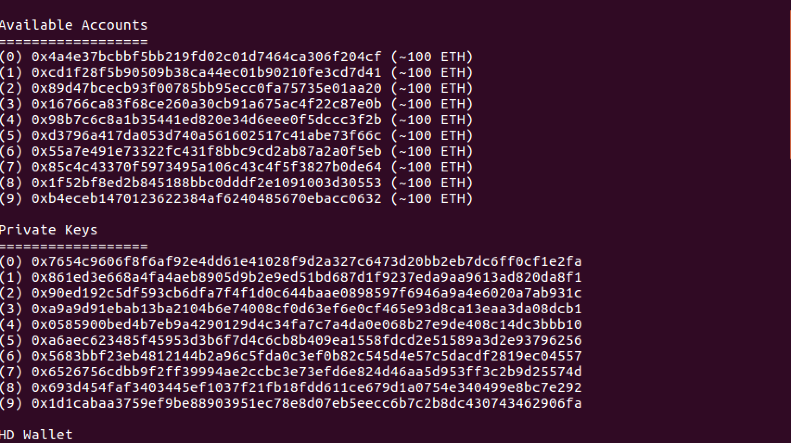

2. Importar wallets a MetaMask

Con MetaMask conectado a la red privada, se inicia sesión

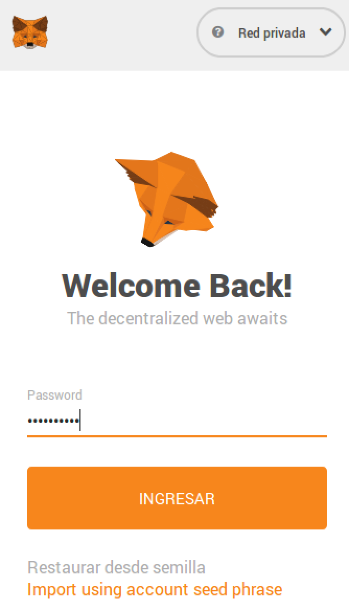

A continuación se procede a importar una de las Wallets indicadas en el paso anterior. Para ello se usará la clave privada de la misma:

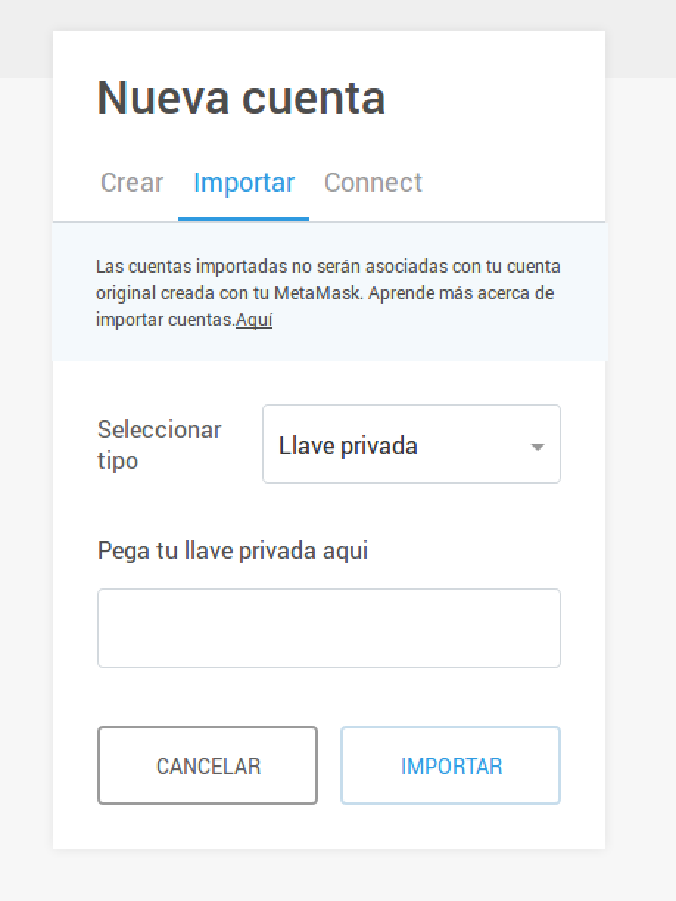

3. Desplegar el código

Se accede a [Remix](http://remix.ethereum.org/) y se copia el código de la página indicada

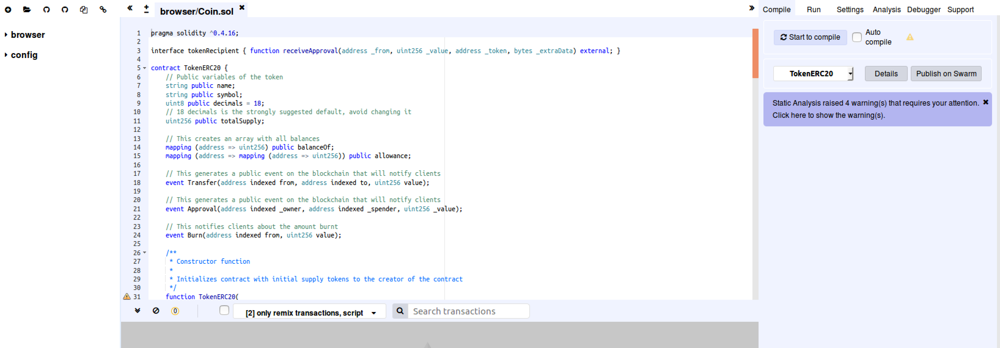

Nos aseguramos que la inyección de web3 se realiza desde nuestra red local que hemos levantado con ganache. Para ello, en la pestaña *Run* se selecciona:

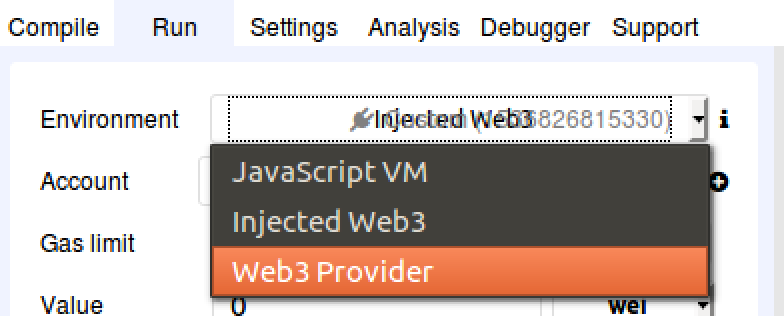

Y ya debe aparecer todo el listado de wallets que se ha levantado con ganache. Para finalizar el despliegue del código,procederemos a inicializar el SmartContract, definiendo los parámetros necesarios para proceder:

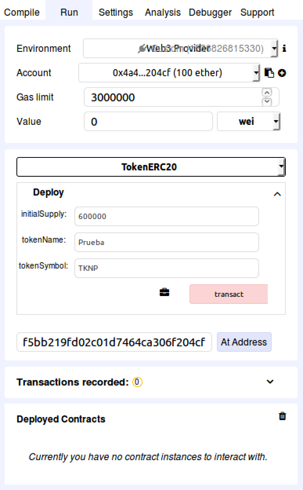

Aparecerá la confirmación en el cuadro inferior y en MetaMask veremos como el balance de la cuenta ha bajado debido al gas quemado para desplegar el contrato:

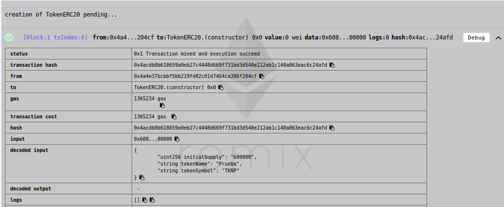

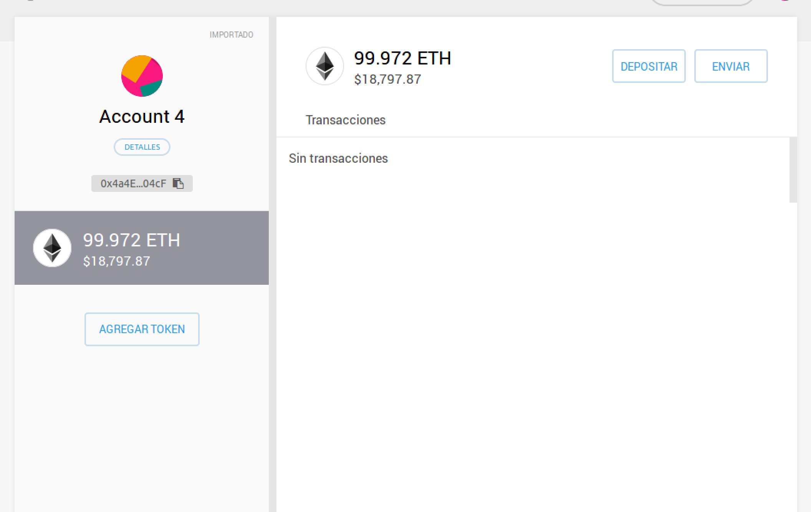

4. Confirmar creación

Para confirmar el despliegue, en este caso se comprobará si, efectivamente, el token creado existe. Para ello en MetaMask utilizaremos la función "Agregar Token":

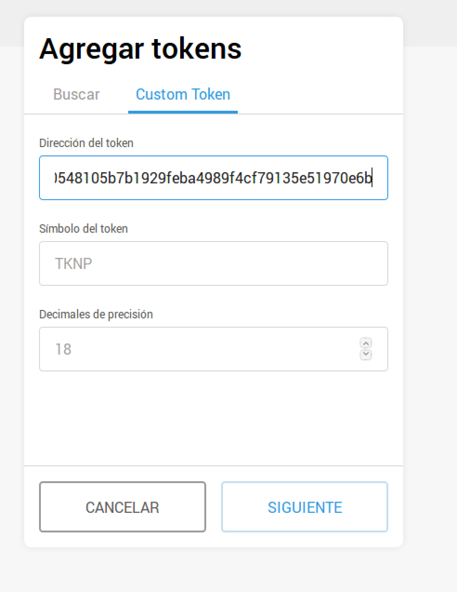

>Para agregar el Token se necesita la dirección del contrato que podemos conseguirla 
>en la consola donde se despliega ganache.

###Interactuar con las funciones

En Remix en la pestaña *Run*, tras desplegar el contrato, nos aparecerán las funciones para poder interactuar con ellas:

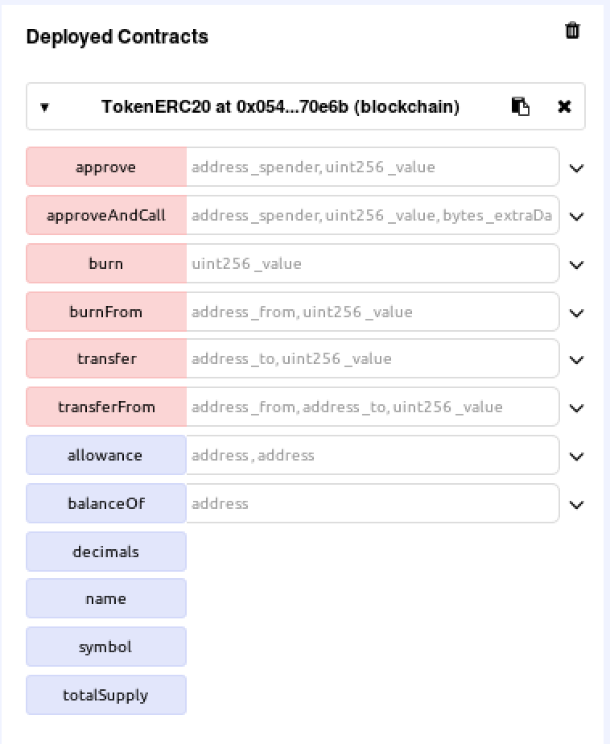

Se realizará una prueba con la función _Transfer_, para ello necesitaremos importar una nueva cuenta a MetaMask y agregarle el Token. Al pulsar en la pestaña lateral de la función _transfer_ aparecen los atributos a completar:

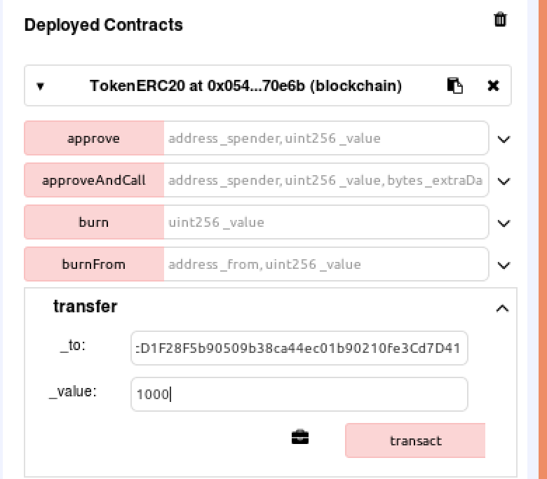

Ahora podemos utilizar la función *BalanceOf* para comprobar el balance de las cuentas y confirmar que la transacción se ha realizado correctamente:

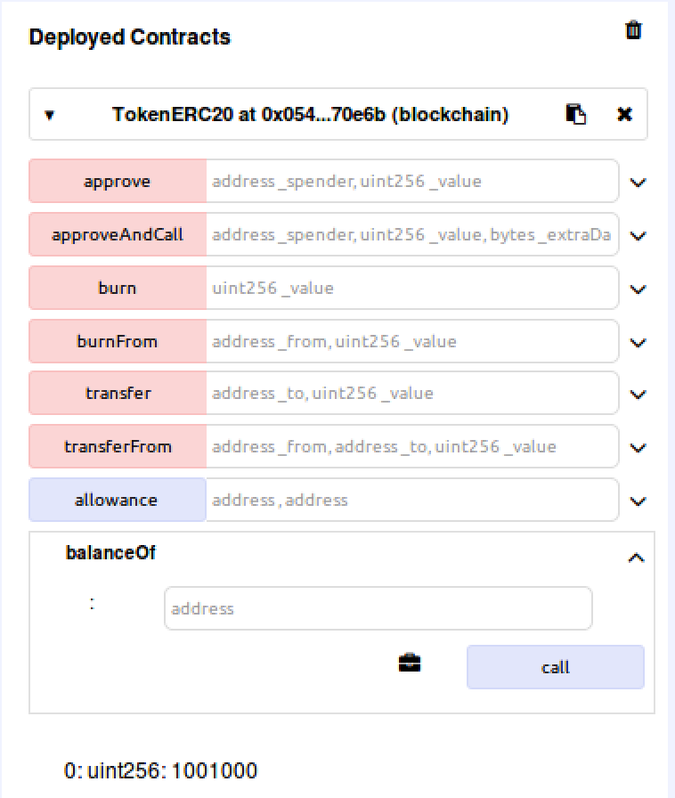

El resultado arrojado en la consulta es el siguiente:

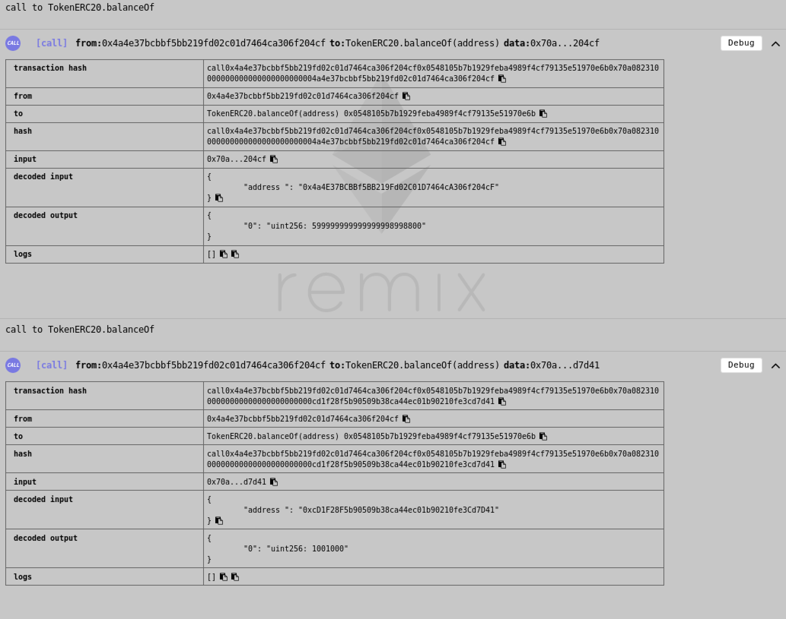

Se observa que existe transferencia entre ambas cuentas.