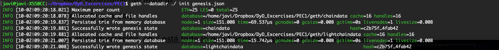
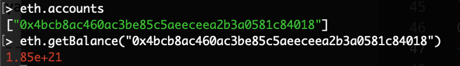
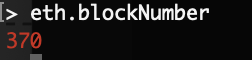
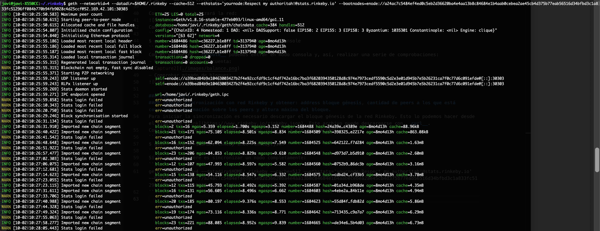
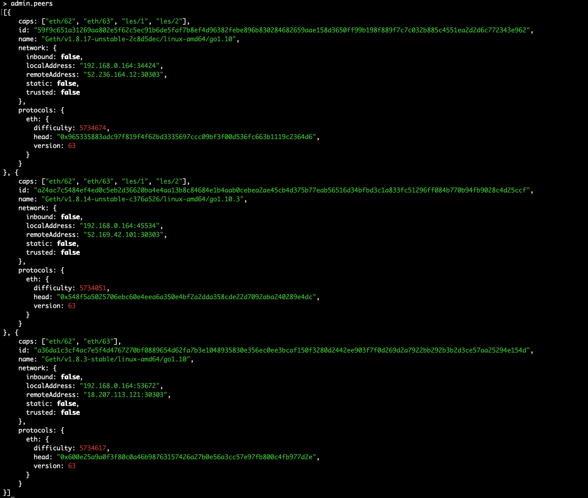
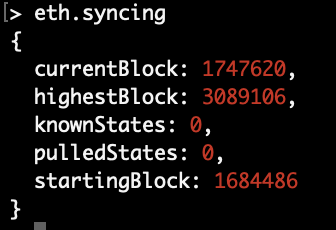

# Master Ethereum, Tecnología Blockchain y Criptoeconomía
## Diseño y Desarrollo - 
## PEC1
### Ejercicio 1
#### Construya y configure su propia blockchain a partir de un archivo génesis , cree su cuenta y consiga ether a partir de la minería

En primer lugar, es necesario crear una cuenta personal:
```
$ geth account new --datadir <path>/PEC1
```
Esto nos creará un directorio .keystore en la ruta que hayamos indicado, lo cual dirá a la blockchain que "somos de fiar".
Ahora que ya tenemos cuenta podemos crear nuestro bloque génesis, que en nuestro caso utilizaremos el siguiente:
```
{
    "config": {
	    "chainId": 15,
	    "homesteadBlock": 0,
	    "eip155Block": 0,
	    "eip158Block": 0
    },
    "difficulty": "0x400",
    "gasLimit": "0x2100000",
    "alloc": {
	    "7a69b359e86893efa3d9732e4c65ced51567edd0": 
	    { "balance": "0x1337000000000000000000" }    
    }
}
```
Los parámetros que aparecen en el bloque génesis son los siguientes:
- **ChainId**: Identifica la red a la que conectarnos. Mainnet correspondería al valor 1, Ropsten al valor 3 y las redes privadas suelen usar el valor 1337. Usaremos la 15 que no suele ser usada.
- **HomesteadBlock**:
- **Eip155Block / Eip158Block**:
- **Difficulty**: Nivel de dificultad del bloque.
- **Gas Limit**: Es un valor agregado al que se especificará en las transacciones.
- **Alloc**: Cargar inicialmente las cuentas con ether. Hay que indicar la dirección de la cuenta y el valor en hexadecimal.
Una vez se tiene el bloque génesis se puede inicializar la red. Para ello, nos situaremos en el mismo directorio que hemos creado el keystore e inicializamos la red:
```
$ geth --datadir ./PEC1 init ./PEC1/genesis.json
```
Con esto se inicializará la red:

Con la red ya inicializada se puede comenzar a minar:
```
$ geth --mine --rpc --networkid 15 --datadir ./ console
```
Con el parámetro __console__ podemos entrar en modo consola y, así, realizar una serie de comprobaciones:
- Comprobar balance de cuenta:

- Comprobar minado de bloques:


### Ejercicio 2
#### Iniciar sincronización con red Rinkeby y obtener: address bloque génesis, cantidad de peers a los que está conectado, información sobre los peers y altura máxima del bloque.
Para iniciar la sincronización es necesario descargar el bloque génesis de la red Rinkeby. Esto lo podemos hacer desde el siguiente [link](https://www.rinkeby.io/rinkeby.json). Este archivo puede descargarse con __curl__. 
Con el bloque génesis descargado, podemos iniciar la sincronización:
```
$ geth --datadir=$HOME/.rinkeby init rinkeby.json
```
Si lo que se quiere es sincronizar un nodo completamente:
```
geth --networkid=4 --datadir=$HOME/.rinkeby --cache=512 --ethstats='yournode:Respect my authoritah!@stats.rinkeby.io' --bootnodes=enode://a24ac7c5484ef4ed0c5eb2d36620ba4e4aa13b8c84684e1b4aab0cebea2ae45cb4d375b77eab56516d34bfbd3c1a833fc51296ff084b770b94fb9028c4d25ccf@52.169.42.101:30303
```
Esto inicializará la sincronización completa con la red:

Para poder acceder por consola y realizar comprobaciones, accederemos al directorio creado ($HOME/.rinkeby) y procederemos a conectarnos a la red mediante el fichero __geth.ipc__:
```
$ geth --datadir=$HOME/.rinkeby attach ipc:$HOME/.rinkeby/geth.ipc console
```
Puesto que el bloque génesis lo hemos descargado e inicializado nosotros para la sincronización, podemos obtener información del mismo y su dirección del siguiente modo:
**Consola Geth**
```
admin.nodeInfo.protocols.eth.genesis
```
Mostrará información del bloque génesis contenida en el nodo.
Para saber el número de peers al que se está conectado, basta con:
```
admin.peers.length
```
Si se quiere obetener información de los peers:
```
admin.peers
```
Ofrecerá información con el siguiente formato:

Para obtener información de la altura máxima del bloque en los peers, se puede obtener suponiendo que los peers a los que nos conectamos están completamente sincronizados con la red y, por tanto, obteniendo parámetros globales de la misma tendremos la altura máxima del bloque en estos peers. Para ello:
```
eth.syncing
```
Ofrecerá información de la sincronización, indicando el bloque por el que va la sincronización de nuestra máquina y el bloque mas alto de la red:


### Ejercicio 3
#### Compilador Solidity. Obtener códigos de operación, Identificadores de funciones y Estimación del gas.
Se supone ya instalado el compilador de solidity. En caso de no tenerlo, para instalar el compilador de solidity:
```
npm install -g solc
```
Se obtiene un contrato de prueba por internet, lo mas simple que ha encontrado:
```
pragma solidity ^0.4.0;
contract Counter {
    int private count = 0;
    function incrementCounter() public {
        count += 1;
    }
    function decrementCounter() public {
        count -= 1;
    }
    function getCount() public constant returns (int) {
        return count;
    }
}
```
Para obtener los códigos de operación, realizamos una compilación primero a binario del código con el compilador:
```
$ solcjs --optimize --bin <archivo.sol>
```
Esto devolverá un archivo __.bin__ que contendrá el byte code del contrato. Esto se puede incluir en un [decompilador](https://etherscan.io/opcode-tool) como el ofrecido por etherscan.io. A continuación, se muestras los OpCodes del contrato:
```
[1] PUSH1 0x80 
[3] PUSH1 0x40 
[4] MSTORE 
[6] PUSH1 0x00 
[7] DUP1 
[8] SSTORE 
[9] CALLVALUE 
[10] DUP1 
[11] ISZERO 
[14] PUSH2 0x0014 
[15] JUMPI 
[17] PUSH1 0x00 
[18] DUP1 
[19] REVERT 
[20] JUMPDEST 
[21] POP 
[23] PUSH1 0xea 
[24] DUP1 
[27] PUSH2 0x0023 
[29] PUSH1 0x00 
[30] CODECOPY 
[32] PUSH1 0x00 
[33] RETURN 
[34] STOP 
[36] PUSH1 0x80 
[38] PUSH1 0x40 
[39] MSTORE 
[41] PUSH1 0x04 
[42] CALLDATASIZE 
[43] LT 
[45] PUSH1 0x52 
[46] JUMPI 
[51] PUSH4 0xffffffff 
[81] PUSH29 0x0100000000000000000000000000000000000000000000000000000000 
[83] PUSH1 0x00 
[84] CALLDATALOAD 
[85] DIV 
[86] AND 
[91] PUSH4 0x5b34b966 
[92] DUP2 
[93] EQ 
[95] PUSH1 0x57 
[96] JUMPI 
[97] DUP1 
[102] PUSH4 0xa87d942c 
[103] EQ 
[105] PUSH1 0x6b 
[106] JUMPI 
[107] DUP1 
[112] PUSH4 0xf5c5ad83 
[113] EQ 
[115] PUSH1 0x8f 
[116] JUMPI 
[117] JUMPDEST 
[119] PUSH1 0x00 
[120] DUP1 
[121] REVERT 
[122] JUMPDEST 
[123] CALLVALUE 
[124] DUP1 
[125] ISZERO 
[127] PUSH1 0x62 
[128] JUMPI 
[130] PUSH1 0x00 
[131] DUP1 
[132] REVERT 
[133] JUMPDEST 
[134] POP 
[136] PUSH1 0x69 
[138] PUSH1 0xa1 
[139] JUMP 
[140] JUMPDEST 
[141] STOP 
[142] JUMPDEST 
[143] CALLVALUE 
[144] DUP1 
[145] ISZERO 
[147] PUSH1 0x76 
[148] JUMPI 
[150] PUSH1 0x00 
[151] DUP1 
[152] REVERT 
[153] JUMPDEST 
[154] POP 
[156] PUSH1 0x7d 
[158] PUSH1 0xac 
[159] JUMP 
[160] JUMPDEST 
[162] PUSH1 0x40 
[163] DUP1 
[164] MLOAD 
[165] SWAP2 
[166] DUP3 
[167] MSTORE 
[168] MLOAD 
[169] SWAP1 
[170] DUP2 
[171] SWAP1 
[172] SUB 
[174] PUSH1 0x20 
[175] ADD 
[176] SWAP1 
[177] RETURN 
[178] JUMPDEST 
[179] CALLVALUE 
[180] DUP1 
[181] ISZERO 
[183] PUSH1 0x9a 
[184] JUMPI 
[186] PUSH1 0x00 
[187] DUP1 
[188] REVERT 
[189] JUMPDEST 
[190] POP 
[192] PUSH1 0x69 
[194] PUSH1 0xb2 
[195] JUMP 
[196] JUMPDEST 
[198] PUSH1 0x00 
[199] DUP1 
[200] SLOAD 
[202] PUSH1 0x01 
[203] ADD 
[204] SWAP1 
[205] SSTORE 
[206] JUMP 
[207] JUMPDEST 
[209] PUSH1 0x00 
[210] SLOAD 
[211] SWAP1 
[212] JUMP 
[213] JUMPDEST 
[215] PUSH1 0x00 
[216] DUP1 
[217] SLOAD 
[219] PUSH1 0x00 
[220] NOT 
[221] ADD 
[222] SWAP1 
[223] SSTORE 
[224] JUMP 
[225] STOP 
[226] LOG1 
[233] PUSH6 0x627a7a723058 
[234] SHA3 
[235] '4f'(Unknown Opcode) 
[236] SWAP8 
[237] 'da'(Unknown Opcode) 
[238] SLT 
[262] PUSH23 0xb2ef51ea86c22dd97cb75b8578d106503fcd30d19cc041 
[263] 'd0'(Unknown Opcode) 
[264] CALLDATALOAD 
```
