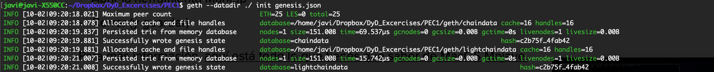
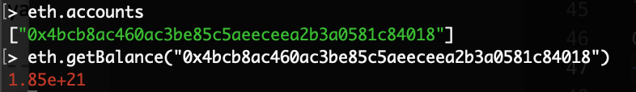
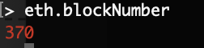

# Master Ethereum, Tecnología Blockchain y Criptoeconomía
## Diseño y Desarrollo - 
## PEC1
### Ejercicio 1
#### Construya y configure su propia blockchain a partir de un archivo génesis , cree su cuenta y consiga ether a partir de la minería

> Para la realización de este ejercicio, se ha tomado como referencia el siguiente [Tutorial](https://medium.facilelogin.com/build-your-own-blockchain-b8eaeea2f891).

En primer lugar, es necesario crear una cuenta personal:
```
$ geth account new --datadir <path>/PEC1
```
Esto nos creará un directorio .keystore en la ruta que hayamos indicado, lo cual dirá a la blockchain que "somos de fiar".
Ahora que ya tenemos cuenta podemos crear nuestro bloque génesis, que en nuestro caso utilizaremos el fichero  que se encuentra en el repositorio. Aquí se copia una captura del mismo:
```
{
    "config": {
	    "chainId": 15,
	    "homesteadBlock": 0,
	    "eip155Block": 0,
	    "eip158Block": 0
    },
    "difficulty": "0x300",
    "gasLimit": "0x1500000",
    "alloc": {
	    "7a69b359e86893efa3d9732e4c65ced51567edd0": 
	    { "balance": "0x1337000000000000000000" }    
    }
}
```

Los parámetros que aparecen en el bloque génesis son los siguientes:
- **ChainId**: Identifica la red a la que conectarnos. Mainnet correspondería al valor 1, Ropsten al valor 3 y las redes privadas suelen usar el valor 1337. Usaremos la 15 que no suele ser usada.
- **HomesteadBlock**:
- **Eip155Block / Eip158Block**:
- **Difficulty**: Nivel de dificultad del bloque.
- **Gas Limit**: Es un valor agregado al que se especificará en las transacciones.
- **Alloc**: Cargar inicialmente las cuentas con ether. Hay que indicar la dirección de la cuenta y el valor en hexadecimal.
Una vez se tiene el bloque génesis se puede inicializar la red. Para ello, nos situaremos en el mismo directorio que hemos creado el keystore e inicializamos la red:
```
$ geth --datadir ./PEC1 init ./PEC1/genesis.json
```
Con esto se inicializará la red:

Con la red ya inicializada se puede comenzar a minar:
```
$ geth --mine --rpc --networkid 15 --datadir ./ console
```
Con el parámetro `console` podemos entrar en modo consola y, así, realizar una serie de comprobaciones:
- Comprobar balance de cuenta:

- Comprobar minado de bloques:
