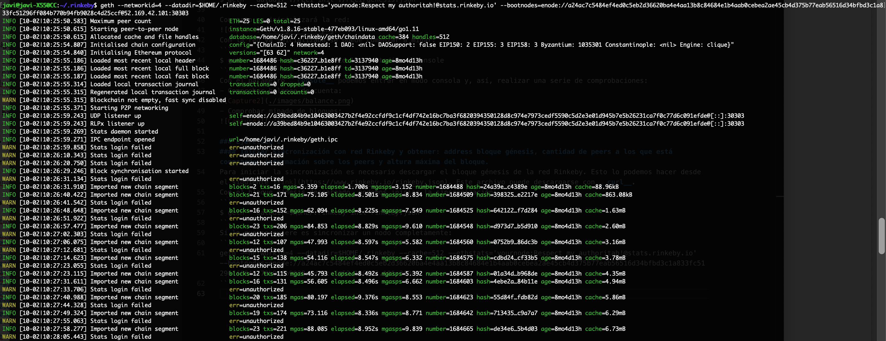
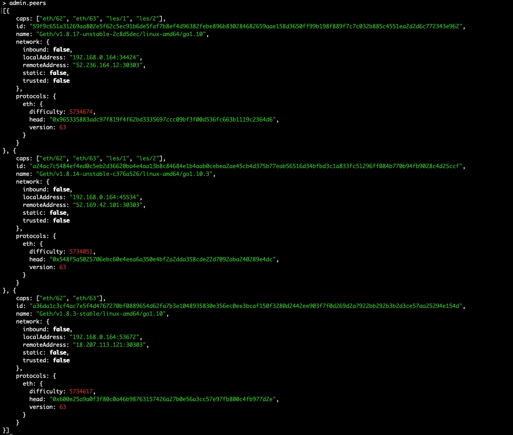
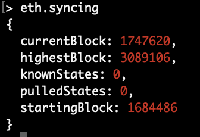

# Master Ethereum, Tecnología Blockchain y Criptoeconomía
## Diseño y Desarrollo - 
## PEC1

### Ejercicio 2
#### Iniciar sincronización con red Rinkeby y obtener: address bloque génesis, cantidad de peers a los que está conectado, información sobre los peers y altura máxima del bloque.
Para iniciar la sincronización es necesario descargar el bloque génesis de la red Rinkeby. Esto lo podemos hacer desde el siguiente [link](https://www.rinkeby.io/rinkeby.json). Este archivo puede descargarse con `curl`. 
Con el bloque génesis descargado, podemos iniciar la sincronización:
```
$ geth --datadir=$HOME/.rinkeby init rinkeby.json
```
Si lo que se quiere es sincronizar un nodo completamente:
```
geth --networkid=4 --datadir=$HOME/.rinkeby --cache=512 --ethstats='yournode:Respect my authoritah!@stats.rinkeby.io' --bootnodes=enode://a24ac7c5484ef4ed0c5eb2d36620ba4e4aa13b8c84684e1b4aab0cebea2ae45cb4d375b77eab56516d34bfbd3c1a833fc51296ff084b770b94fb9028c4d25ccf@52.169.42.101:30303
```
Esto inicializará la sincronización completa con la red:

Para poder acceder por consola y realizar comprobaciones, accederemos al directorio creado ($HOME/.rinkeby) y procederemos a conectarnos a la red mediante el fichero `geth.ipc`:
```
$ geth --datadir=$HOME/.rinkeby attach ipc:$HOME/.rinkeby/geth.ipc console
```
Puesto que el bloque génesis lo hemos descargado e inicializado nosotros para la sincronización, podemos obtener información del mismo y su dirección del siguiente modo:
**Consola Geth**
```
admin.nodeInfo.protocols.eth.genesis
```
Mostrará información del bloque génesis contenida en el nodo.
Para saber el número de peers al que se está conectado, basta con:
```
admin.peers.length
```
Si se quiere obetener información de los peers:
```
admin.peers
```
Ofrecerá información con el siguiente formato:

Para obtener información de la altura máxima del bloque en los peers, se puede obtener suponiendo que los peers a los que nos conectamos están completamente sincronizados con la red y, por tanto, obteniendo parámetros globales de la misma tendremos la altura máxima del bloque en estos peers. Para ello:
```
eth.syncing
```
Ofrecerá información de la sincronización, indicando el bloque por el que va la sincronización de nuestra máquina y el bloque mas alto de la red:
