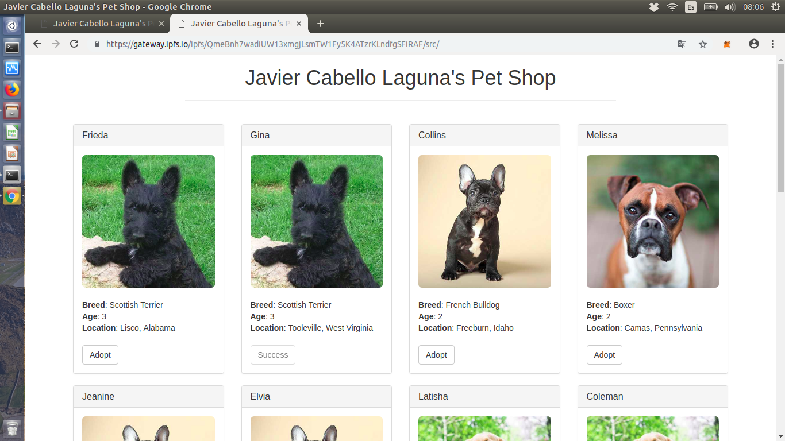
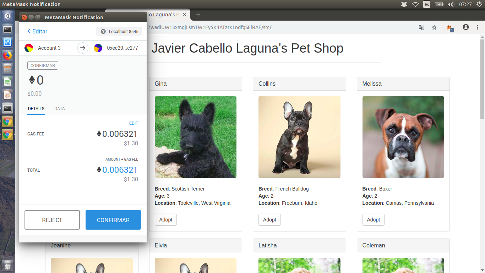
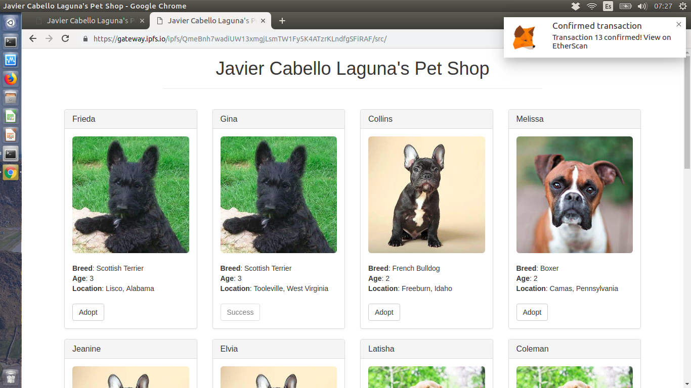

# Master Ethereum, Tecnología Blockchain y Criptoeconomía
## Diseño y Desarrollo - 
## PEC2
### Ejercicio 2 - IPFS

> Para la realización de este ejercicio, se ha tomado como referencia la siguiente documentación:
> [IPFS - Oficial](https://docs.ipfs.io)
> [IPFS - Medium](https://medium.com/@merunasgrincalaitis/the-ultimate-end-to-end-tutorial-to-create-and-deploy-a-fully-descentralized-dapp-in-ethereum-18f0cf6d7e0e)

#### Preparando el entorno

> Se recomienda seguir la documentación oficial para
> la instalación de IPFS. Para la realización de este
> ejercicio se supone ya instalado.

Una vez instalado IPFS, se debe proceder a inicializar el nodo:

```
$ ipfs init
```

El resultado devuelto es algo similar a lo siguiente:

```
initializing IPFS node at /home/javi/.ipfs
generating 2048-bit RSA keypair...done
peer identity: QmZcnTBHPDSqi8xy36omUYbJuLkJYdJp6DZqvKX27jCMFR
to get started, enter:

ipfs cat /ipfs/QmS4ustL54uo8FzR9455qaxZwuMiUhyvMcX9Ba8nUH4uVv/readme
```

Con el nodo ya inicializado, se puede proceder a inicializar el demonio ```$ ipfs daemon``` para poder conectar el nodo On-line. La primera vez que se conecta es probable que aparezca el siguiente error:

```
Initializing daemon...
Successfully raised file descriptor limit to 2048.
Swarm listening on /ip4/127.0.0.1/tcp/4001
Swarm listening on /ip4/172.17.0.1/tcp/4001
Swarm listening on /ip4/172.18.0.1/tcp/4001
Swarm listening on /ip4/172.19.0.1/tcp/4001
Swarm listening on /ip4/172.20.0.1/tcp/4001
Swarm listening on /ip4/192.168.0.164/tcp/4001
Swarm listening on /ip6/::1/tcp/4001
Swarm listening on /p2p-circuit/ipfs/QmZcnTBHPDSqi8xy36omUYbJuLkJYdJp6DZqvKX27jCMFR
Swarm announcing /ip4/127.0.0.1/tcp/4001
Swarm announcing /ip4/172.17.0.1/tcp/4001
Swarm announcing /ip4/172.18.0.1/tcp/4001
Swarm announcing /ip4/172.19.0.1/tcp/4001
Swarm announcing /ip4/172.20.0.1/tcp/4001
Swarm announcing /ip4/192.168.0.164/tcp/4001
Swarm announcing /ip6/::1/tcp/4001
API server listening on /ip4/127.0.0.1/tcp/5001
Error: serveHTTPGateway: manet.Listen(/ip4/127.0.0.1/tcp/8080) failed: listen tcp4 127.0.0.1:8080: bind: address already in use
Received interrupt signal, shutting down...
(Hit ctrl-c again to force-shutdown the daemon.)
```

Esto se debe a que el puerto está ocupado, por lo que es necesario modificar el archivo ```~/.ipfs/config``` para indicar la ejecución desde otro puerto.

Con el nodo ya inicializado, se deberá inicializar ```ganache-cli```, tal y como se indica en el siguiente [enlace](https://github.com/javicabellolg/DyD_Master/blob/master/DyDa1-Modulo_1/DyDa1.2-Solidity.md)

#### Subiendo la aplicación a IPFS

Con todo el entorno ya listo, se puede proceder a subir la aplicación a IPFS. Para ello, es necesario subir el código de la aplicación alojado en:

- ```__build__```: Contiene los .json compilados por truffle de los contratos de la aplicación.
- ```__src__```: Contiene el ```index.html``` y el bundling del front.

> El directorio se adjunta en el repositorio. Se encuentra en el directorio 

En el caso que aplica, el directorio ```src```se ha alojado dentro de ```build```, quedando como se indica a continuación:

```
javi@javi-X550CC:~/Escritorio/blockchain/pet-shop-tutorial$ ls build
contracts  src
```

```
javi@javi-X550CC:~/Escritorio/blockchain/pet-shop-tutorial$ ls src/
css  fonts  images  index.html  js  pets.json
```
##### Modificaciones previas a la subida

Antes de realizar la subida, para asegurar que la aplicación funcione correctamente, es necesario realizar algunos cambios relacionados con rutas relativas que se encuentran en el archivo , para que detecte correctamente el contrato de adopción y el archivo .

Los cambios a realizar son los siguientes:

1. ```/build/src/js/app.js```. Línea 7:
```
 $.getJSON('../pets.json', function(data) { ---------->  $.getJSON('./pets.json', function(data) {
```
2. ```/build/src/js/app.js```. Línea 37:
```
$.getJSON('Adoption.json', function(data) { ----> $.getJSON('../contracts/Adoption.json', function(data) {
```

> En la versión entregada ya se encuentran los cambios realizados.
> Se indican aquí para tenerlo en cuenta si alguien realiza el proceso desde el inicio.

##### Subida IPFS

Para subir todo a IPFS, se indica a continuación el comando:

```
$ ipfs add -r build/
```

La respuesta, debe ser algo parecido al siguiente:

```
added QmdPVZNEgMXQP2cLiDk9nvGDtahxajDCazau7mT6Yx5ATG build/contracts/Adoption.json
added QmSSazgLqRFv7d78JQX8hnA1F8GxfRwNqzyEzCfxS6nJLw build/contracts/Migrations.json
added QmYUaCPwvJWiueRXFSTTv8vdedWWzRhRdn8RMw35e7k67u build/src/css/bootstrap.min.css
added QmbrzMumAwEPCoLs6jBdDyHz2TBjpkSFhcCHMT7fBsdFyr build/src/css/bootstrap.min.css.map
added QmWhoNhVUb9bcjuKLB259VYogJpPsJaAe8dern9LK95tVN build/src/fonts/glyphicons-halflings-regular.eot
added QmbcbjLEC1aHy4j2qvtncevjenYwHjEF4qZ2kK5pRJzDLg build/src/fonts/glyphicons-halflings-regular.svg
added QmciDEkreBpY2S6Ktg1Zarbsx5K2DmHK59H261Bjr2fnuR build/src/fonts/glyphicons-halflings-regular.ttf
added QmaYEdLkMnEHVN8HZB2GGETottySZoHh3TnYZERke36PVr build/src/fonts/glyphicons-halflings-regular.woff
added QmUbUsBQbjJhm5iYba5jqibRr4A6gG3HVczSy5gs5PrMhY build/src/fonts/glyphicons-halflings-regular.woff2
added QmacvUkwHXqjqaHevcNXRvTHompuCSXgTwFRxp2yWJQJah build/src/images/boxer.jpeg
added QmcCkw63o2kTaMwHhuUtqZ9cqX7rbVGv9wFJD5nwaXkWPv build/src/images/french-bulldog.jpeg
added Qmaj7LUwb7T5sMFyznMGS1cAGPyVJL6Vhjwemq4zb1Nbex build/src/images/golden-retriever.jpeg
added QmT3m9b5UDTr9gKgN1xKQfS5fSKAx8AdZCJ1XJxJTii29m build/src/images/scottish-terrier.jpeg
added QmWZSuN9KKLZ1a1VLnBw4PiqfejkPy92HLgueCEDcioGX5 build/src/index.html
added QmVZPJtdnAqKMe2ftvTMYsvXg8yJXA2RQfAYfyohZs7JRN build/src/js/app.js
added QmNXRFREw7waGtKW9uBUze3PkR9E12HeeAQSkZQSiFUJqo build/src/js/bootstrap.min.js
added QmZQp29tbdppjqyixxM8L8NjsG4paN4eVW9GxZYicXov9v build/src/js/truffle-contract.js
added QmdTtsVM7KtvycQ68f9M43N4EQKvbd58q8aeAhP2fMz4Di build/src/js/web3.min.js
added QmZKHAuYoeAjHqfhi2jJaELDfMBj6dtydz7UsZv3BPaon8 build/src/pets.json
added QmbjMs7sH25JsX7xDEXtfbowxVVXHZpnE6vSkRQBbazZPs build/contracts
added QmQfwrATTrJc1aTN1dVu9K7nQ5rw67np8yg46EvAbqKEZw build/src/css
added Qmb3fJpXVGvUnNeRLC3P5sTXMzjpf5zq4tKt9XjhtYFf1k build/src/fonts
added QmQo4AjSx9JkNsHa3nRqxtryx6iGHmqGprhm2ic2MztW3Y build/src/images
added Qmb99zKkc3J6NcyHy5KvuoKBdyTejccrAb4gPTvjkZVK8p build/src/js
added QmccTPdE7mczho2jWcfX7FWeSUAQ8Fj4WwzGMwjTXwyHWg build/src
added QmeBnh7wadiUW13xmgjLsmTW1Fy5K4ATzrKLndfgSFiRAF build
```

> Se copia respuesta para tener el hash de IPFS

Con este hash que se ha devuelto se puede acceder vía navegador a la aplicación.

#### Accediendo a la dAPP

Para acceder a la dAPP, se utilizará el gateway de ipfs. En el siguiente [link](https://gateway.ipfs.io/ipfs/QmeBnh7wadiUW13xmgjLsmTW1Fy5K4ATzrKLndfgSFiRAF/src/) es el enlace a la aplicación desde el que se puede acceder a la misma.



> PRECAUCIONES:
> 1. Es necesario tener la aplicación desplegada en la red Ganache local
> 2. Es necesario conectar MetaMask a la red local de Ganache

Se muestra, a continuación un ejemplo de funcionamiento del proceso de adopción y como, efectivamente se confirma la transacción:


