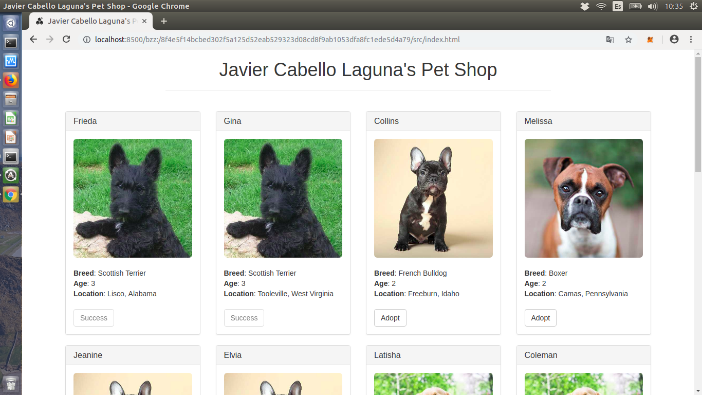

# Master Ethereum, Tecnología Blockchain y Criptoeconomía
## Diseño y Desarrollo - 
## PEC2
### Ejercicio 3 - Swarm

> Para la realización de este ejercicio, se ha tomado como referencia la siguiente documentación:
> [Swarm - Oficial](https://swarm-guide.readthedocs.io/en/latest/introduction.html)


#### Preparando el entorno

> Se recomienda seguir la documentación oficial para la instalación de Swarm, aunque es probable que ya esté instalado si se tiene __geth__. 
> Para la realización de este ejercicio se supone ya instalado.

En primer lugar es conveniente tener un nodo de Rinkeby actualizado, tal y como se indica en el [Ejercicio 1](https://github.com/javicabellolg/DyD_Master/blob/master/DyDa3-Modulo_3/Ejercicio1%20-%20ENS/DyDa3.1-PEC2_Ejercicio%202.md).

Con el nodo ya sincronizado, se puede proceder a publicar el proyecto en la testnet (que en el caso que ocupa se tratará de __Rinkeby__), para lo cual hay que editar el fichero ```truffle.js``` que se tiene en la raíz del proyecto de __truffle__. Su apariencia debe ser similar a la que sigue:

```
module.exports = {
  // See <http://truffleframework.com/docs/advanced/configuration>
  // for more about customizing your Truffle configuration!
  networks: {
    development: {
      host: "127.0.0.1",
      port: 9545,
      network_id: "*" // Match any network id
    },
    rinkeby: {
      host: "localhost",
      port: 8545,
      network_id: "4",
      from:"0xef1c2fda40129d7cd7e5218162f60122c68ca047",
      gas: 6712390
    }
  }
};
```

Se añade el módulo llamado ```rinkeby``` que contiene los parámetros de conexión a la tesnet del mismo nombre. Además, se incluye un parámetro __from__ con la dirección por defecto desde la cual realizar la transacción para poder llevar a cabo la migración y el límite de gas. Además se indica la __id__ de la red de rinkeby.

> La dirección que se indica en el parámetro __from__ debe ser desbloqueada para poder realizar la transacción. Para evitar errores
> en el caso que ocupa se ha procedido a conectar a la consola de __geth__ (tal y como se indica en el [Ejercicio 1](https://github.com/javicabellolg/DyD_Master/blob/master/DyDa3-Modulo_3/Ejercicio1%20-%20ENS/DyDa3.1-PEC2_Ejercicio%202.md)) y desbloquearla previamente.

> ```
>personal.unlockAccount(eth.accounts[2])
>Unlock account 0xef1c2fda40129d7cd7e5218162f60122c68ca047
>Passphrase: 
>true
> ```

Cone sto ya se tendrá desbloqueada la cuenta y todo preparado para proceder. 

#### Publicando el proyecto en Rinkeby

Se procede a publicar el proyecto en rinkeby:

```
$ truffle migrate --network rinkeby
```

Si todo está bien, el resultado indicará las direcciones de los contratos publicados:

```
javi@javi-X550CC:~/Escritorio/blockchain/pet-shop-tutorial$ truffle migrate --network rinkeby
Using network 'rinkeby'.

Running migration: 1_initial_migration.js
  Deploying Migrations...
  ... 0xe42885bf574493f0ba426ce83dcb0bcfbf21cb87bb9d184aca38ee1bcb3f75ae
  Migrations: 0xf68da3d4fe09047e0d95e00c7b139f82ad8b0fe3
Saving successful migration to network...
  ... 0x501ff9accbd4b2654ca9750c686049221dcac506e62bef1cad1dfafec8bef0bd
Saving artifacts...
Running migration: 2_deploy_contracts.js
  Deploying Adoption...
  ... 0x32a97ca85eeb1f031b13041c8a95c2d66b71f9e140586393d329d7a0f0ae8c76
  Adoption: 0x257be1596e07a95deeae25d4972d95b5d5685f42
Saving successful migration to network...
  ... 0xa3f7aa95cdb7cb4febbdbf8fc7a196501dc88498f2b43d494ee849de7a3b5d19
Saving artifacts...
```

> En la respuesta se observa la dirección de los contratos y que están desplegados en Rinkeby.

Ya se tiene el proyecto desplegado en Rinkeby, por lo que se procederá ahora a desplegar el proyecto en swarm:

#### Publicando el proyecto en Swarm

Se crea una cuenta nueva en swarm y se establece como cuenta por defecto para inicializar el nodo:

```
$ geth account new
```
```
$ swarm --bzzaccount <dir>
```

Si todo es correcto, conectará correctamente:

```
javi@javi-X550CC:~/Escritorio/blockchain/pet-shop-tutorial$ *geth account new*
INFO [10-24|10:06:16.220] Maximum peer count                       ETH=25 LES=0 total=25
Your new account is locked with a password. Please give a password. Do not forget this password.
Passphrase: 
Repeat passphrase: 
*Address: {31501038d3e8acc77cbc8a47172d8acd32d26cac}*
javi@javi-X550CC:~/Escritorio/blockchain/pet-shop-tutorial$ *swarm --bzzaccount 31501038d3e8acc77cbc8a47172d8acd32d26cac*
INFO [10-24|10:06:37.934] Maximum peer count                       ETH=25 LES=0 total=25
Unlocking swarm account 0x31501038d3e8acc77cBC8A47172D8ACd32D26cAC [1/3]
Passphrase: 
INFO [10-24|10:06:40.894] Starting peer-to-peer node               instance=swarm/v0.3.5-bd1f7ebd/linux-amd64/go1.11
INFO [10-24|10:06:41.263] Starting P2P networking 
INFO [10-24|10:06:44.110] UDP listener up                          self=enode://031d9e1ae067ea560eddaaa29d3755527f2d6d3e9fa0c33dac9c9f882dd00f142c74b120b97a9260812fae292d26f6d5b6cd97b4149d722ebed28ca27ceded50@[::]:30399
INFO [10-24|10:06:44.111] RLPx listener up                         self=enode://031d9e1ae067ea560eddaaa29d3755527f2d6d3e9fa0c33dac9c9f882dd00f142c74b120b97a9260812fae292d26f6d5b6cd97b4149d722ebed28ca27ceded50@[::]:30399
INFO [10-24|10:06:44.111] Updated bzz local addr                   oaddr=5bc23ccab7e8f43dce22793dbd243c7fbf6beda7e26c435bf23aa0ee0b0ad8f7 uaddr=enode://031d9e1ae067ea560eddaaa29d3755527f2d6d3e9fa0c33dac9c9f882dd00f142c74b120b97a9260812fae292d26f6d5b6cd97b4149d722ebed28ca27ceded50@[::]:30399
INFO [10-24|10:06:44.111] Starting bzz service 
INFO [10-24|10:06:44.111] Starting hive                            baseaddr=5bc23cca
INFO [10-24|10:06:44.111] Detected an existing store. trying to load peers 
INFO [10-24|10:06:44.111] hive 5bc23cca: no persisted peers found 
INFO [10-24|10:06:44.111] Swarm network started                    bzzaddr=5bc23ccab7e8f43dce22793dbd243c7fbf6beda7e26c435bf23aa0ee0b0ad8f7
INFO [10-24|10:06:44.112] Started Pss 
INFO [10-24|10:06:44.112] Loaded EC keys                           pubkey=0x04d93d2d71979bc1202b88f18547544bfd1f69f47646b4dba40958d57f06b4ce9548d266c7332ab20e4a8f254d80020e1c87e5d74c3b0a833c60db126deabc474f secp256=0x03d93d2d71979bc1202b88f18547544bfd1f69f47646b4dba40958d57f06b4ce95
INFO [10-24|10:06:44.112] Streamer started 
INFO [10-24|10:06:44.183] IPC endpoint opened                      url=/home/javi/.ethereum/bzzd.ipc
```
> Se han remarcado los punto clave de la salida. En la imagen se observa como se inicializa el nodo de swarm.

Ahora se puede proceder a subir la aplicación a swarm. Al igual que se hizo en el [Ejercicio 2](https://github.com/javicabellolg/DyD_Master/blob/master/DyDa3-Modulo_3/Ejercicio2%20-%20IPFS/DyDa3.2-PEC2_Ejercicio%202.md), se subirá el directorio .

```
javi@javi-X550CC:~/Escritorio/blockchain/pet-shop-tutorial$ swarm --recursive up build/
8f4e5f14bcbed302f5a125d52eab529323d08cd8f9ab1053dfa8fc1ede5d4a79
```

Devuelve un hash que es su __manifest__. Con esto se puede acceder a localhost:8500/bzz:/<manifest>/src/index.html que es donde estaría alojada la aplicación y realizar adopciones. A continuación se muestran dos pantallas donde se ve el acceso a la aplicación y el proceso de adopción con la transacción aceptada que, además muestra al cachorro adoptado:


