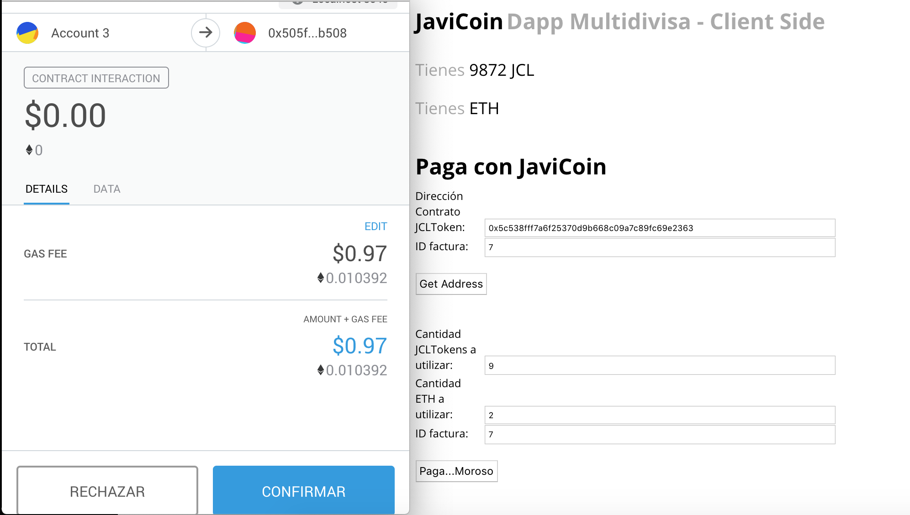

# Master Ethereum, Tecnología Blockchain y Criptoeconomía
## Diseño y Desarrollo - 
## PEC 3: Trabajo Final - Sistema de pago a proveedores con registros de Facturas

> Para la realización del siguiente proyecto se ha tomado como referencia el proyecto truffle webpack, por lo que la parte del Front End puede tener ciertas similitudes 
> estéticas. Se ha creado un token propio (JCLToken) con un supply y decimales diferentes, estableciendo por defecto el tipo de cambio en 1 JCLToken = 1 Wei. No es alcance 
> de este trabajo la realización de la tasa de conversión. El desarrollo de SmartContracts, Conexión vía Web3, Testing y Funcionalidad es completamente original.

## Objetivo y alcance del trabajo

Se va a realizar una aplicación que permita el registro de facturas pendientes de pago. La funcionalidad será básica, el usuario que requiere el pago (en adelante proveedor) registra una factura en la Blockchain. En este registro se indica el id de la factura, usuario a quien se requiere el cobro (en adelante cliente) y la cantida que se adeuda.

Una vez registrada la factura, el cliente puede efectuar el pago al proveedor haciendo uso de los tokens, los ethers o de ambos. Por defecto, se ha establecido que todas las unidades sean equivalente a Weis. Por tanto, la cantidad que se indica adeudada estará indicada en Weis y la tasa de cambio del Token personalizado es 1 Token = 1 wei.

## Consideraciones previas

Para la correcta ejecución del programa es necesario tener instalado:
- npm version 5.6.0 o superior
- truffle version 4.1.14 o superior
- solidity version 0.4.24
- ganache o Ganache-cli
- librería OpenZeppelin: `$ npm install openzeppelin-solidity`

El resto de dependencias necesarias se encuentran en el fichero _package.json_ para que sean instaladas en la ejecución de `$ npm install`inicial

Con esto se puede proceder a descargar del [repositorio habilitado] (https://github.com/javicabellolg/DyD_Master/tree/dev/PEC3/1-webpack) los archivos para la ejecución de la dApp. Una vez descargado es necesario acceder a la raíz y ejecutar `npm install` para instalar todas las dependencias necesarias.

Una vez instaladas las dependencias es necesario compilar los contratos, pues se proporcionan sin compilar:
`$ truffle compile`
Antes de realizar la migración es necesario tener una red disponible donde desplegar los contratos. Para ello, se utilizará `ganache-cli`. Para evitar el bajo límite de gas que por defecto tiene ganache, se utilizará el flag `-l` que permite establecer el límite personalizado:
`$ ganache-cli -l 100000000`
>Como se observa se establece un límite suficientemente alto.
Por otro lado, al modificar el límite en la red también es necesario establecer un límite de gas para el proyecto, esto se hará en el fichero `truffle.js`. A continuación se muestra la configuración establecida para este proyecto:
```
module.exports = {
  networks: {
    ganache: {
      host: '127.0.0.1',
      port: 8545,
      gas:"29000000",
      network_id: '*' // Match any network id
    }
  }
}
```
Con esto, se puede proceder a migrar el proyecto a la red:
```
$ truffle migrate --network ganache
```
Aparecerán las direcciones de todos los contratos que se despliegan:
```
MacBook-Pro-de-Javier-Cabello:1-webpack JaviMac$ truffle migrate --network ganache
Using network 'ganache'.

Running migration: 1_initial_migration.js
  Deploying Migrations...
  ... 0x7c111554a8217418fcbe551c9a69140505c4c01adc43299ec6e7a40a6b54f0fe
  Migrations: 0x47fe9e0aa190c0f633b30750b8cc3e2137f82bb4
Saving successful migration to network...
  ... 0xfe8ec31f9391f8a665ff5101a88293dd756ad015aeb37a11cda755907c4699e9
Saving artifacts...
Running migration: 2_deploy_contracts.js
  Deploying JCLToken...
  ... 0xa0f8b522ff20ebb5a5c6b6bc17350ecd081746d06936a76793aa94f969c2cf72
  JCLToken: 0x766a7df1c19d89ea8cdb2c0b9f5af35cf8a525b7
  Deploying JCLFactory...
  ... 0xedd7602d0a1c82f9904b1064b7068ace20cf3d78399700cf47b6479879c3a13e
  JCLFactory: 0xe92e392ba106f7ee91956b77693c07186f80dc3a
  Deploying createBills...
  ... 0x5b8b891a7db582e6d29c8a126d356031ef4523600f91a4c7c5eed7d4cbd33835
  createBills: 0x7eafe5e4aadaaa2ed0567fea5a377bb52d71d0bd
Saving successful migration to network...
  ... 0x1c0bd29d881896c6f10906e3ec56ab0dbb0008e051c17693fb1fbbffebf0fb70
Saving artifacts...
Running migration: 3_mint_tokens.js
la red es la siguiente
ganache
Saving successful migration to network...
  ... 0xed9df7c260470d2c6442970a60d6fe4751709c03f0c3ee922357416a3df7c9db
Saving artifacts...
```
Como puede verse se despliegan varios contratos que, a continuación, se pasa a explicar su funcionalidad:
- **JCLToken.sol**: Contrato prefijado y tomado de una plantilla. Se especifica en el contrato que sea un token ERC20, heredando las propiedades de estos, con esto se evitan ciertas brechas de seguridad conocidas asociadas a las transferencias como el _reentrancy_. Se especifica un supply inicial y el símbolo del token (_JCL_). Simplemente proporciona un token, no siendo el objetivo de este trabajo funcionalidades asociadas.
- **JCLFactory.sol**: Este contrato es de creación propia. Es un _factory contract_ que se encarga de dar de alta a los requerimientos de pago. Como estos requerimientos únicamente se pueden dar de alta por los proveedores, se ha heredado propiedades de _Ownable.sol_. Se ha hecho el owner del contrato a la cuenta que lo despliega, considerando esta como el proveedor principal. Gracias a la herencia de _Ownable.sol_ y al modificador _OnlyOwner_ únicamente la cuenta 0 `account[0]`puede dar de alta las facturas.
> Se establece la cuenta `account[0]` por ser la que se tiene definida por defecto como coinbase. Para este trabajo se ha supuesto un único proveedor, en el futuro se ampliará esta funcionalidad.
- **CreateBills.sol**: Es el contrato que gestiona los requerimientos de cobro. Se mantendrá activo hasta que el cliente haya satisfecho el pago completo de la cantidad adeudada. Así mismo, tiene una parada de emergencia que únicamente puede activar el _owner_ del contrato (que es el proveedor `account[0]`). Se han tomado medidas de seguridad para evitar que únicamente la cuenta _owner_ del contrato sea capaz de eliminar de emergencia el contrato. Así mismo, se hace uso de la librería `SafeMath.sol` para evitar problemas de seguridad conocidos como `overflow` o `underflow`. Así mismo, se fija el destinatario en el contrato que por defecto es el _owner_ del mismo dado que es el que habilita el requerimiento de pago. De esta forma, se evita comportamientos maliciosos, desviando fondos a otras cuentas y reduciendo la cantidad adeudada, puesto que no tiene posibilidad de configurarlo en la llamada de la función. De este modo, la dApp cuando el cliente realiza un pago pasará a la función los siguientes parámetros:
```
function payingWithToken **(address _client, uint _amount)** external payable paying(_client, _amount) returns (uint) {
```
El parámetro correspondiente al `_to` está definido desde la creación del contrato en un struct. Se copia el constructor:
```
constructor(address _client, address _supplyerAddress, uint _id, uint _amount) public {
            owner = _supplyerAddress;
            ownerBill[_client].id = _id;
            ownerBill[_client].amount = _amount;
            ownerBill[_client].ownerSupply = _supplyerAddress;
            emit billRegister(_id, _amount, _client);
    }
```
Si se observa la llamada desde el contrato `JCLFactory.sol`:
```
idToOwner[_id] = new createBills(_client, msg.sender, _id, _amount);
```
El parámetro `_supplyerAddress` se pasa como el `msg.sender` de `JCLFactory.sol` que, como se ha comentado anteriormente, solo puede ejecutar el proveedor.

### Levantando el Front

Para habilitar el Front y poder acceder a la interfaz gráfica de la dApp, será necesario situarse en la raíz y ejecutar:

```
npm run dev
```

Aparecerá levantada en `http://localhost:8080`la aplicación.

## Interactuando con la aplicación
Al acceder a la aplicación se tendrá una pantalla similar a la siguiente y que se va a proceder a explicar punto a punto:
> La visualización de la pantalla no es la mejor y es un punto a mejorar, pero no entra en el alcance de este trabajo.

> Aparecerán mensajes de alerta que guiarán al usuario en los primeros pasos, no obstante se procede a explicar detenidamente.
Se observan dos partes claramente diferenciadas. La parte del proveedor (arriba izquierda) y la parte del cliente (abajo derecha). Se han puesto conjuntas, aunque no sea la forma mas apropiada, de forma que sea mas sencillo para realizar las pruebas. Lo ideal es que estuviesen en pantallas separadas, pero de esta forma nos permitirá probar todas las funcionalidades en una única pantalla.
### Registrando la primera factura
En primer lugar, la primera información que le aparece al usuario es su cuenta y la cantidad de tokens personales con los que cuenta.
> Esta información se actualizará automáticamente en cuanto se modifique la cuenta en MetaMask.
Para registrar la primera factura, es necesario asegurarse que la cuenta activa en MetaMask es la cuenta con la que se realizó el despliegue (o coinbase). En caso contrario, y para guiar al usuario, la transacción fallará y aparecerá un mensaje de alerta al intentar registrar una factura:


Una vez que se ha asegurado que se tiene la cuenta indicada, se procede a rellenar los siguientes campos:
- **ID Factura**: Es un ID de referencia de la factura, únicamente atiende códigos numéricos. En el interior del recuadro se copia un ejemplo para guiar al usuario.
- **Acumulado Factura**: Es un valor numérico y hay que tener en cuenta que se considerará como valor en weis. En el interior del recuadro se hace constar esto mismo para guiar al usuario.
- **Dirección a quien se requiere el pago**: En un valor alfanumérico que representará la dirección del cliente a quien se requiere el pago.
Una vez se han rellenado estos campos, se puede proceder al registro de la factura pulsando el botón **Registrar** que se encuentra mas abajo. Inmediatamente aparecerá justo abajo un mensaje indicando que la transacción se está realizando aparecerá la ventana de firma de transacción de MetaMask:

### Realizando el Pago
En primer lugar antes de realizar el pago, hay que tener en cuenta que la cuenta que tiene todos los fondos de tokens personalizados es la cuenta `account[0]`, por lo que es conveniente realizar una transacción a la cuenta `account[1]` para que esta tenga fondos y se pueda hacer una prueba completa de la funcionalidad de la aplicación. Para ello, habría que acceder por consola `$ truffle console --network ganache` y ejecutar el siguiente comando:
```
$ JCLToken.deployed().transfer(web3.eth.accounts[1],300000)
```
> Se ha indicado el valor `300000` como ejemplo aunque puede ser cualquier valor siempre que no supere el SupplyInicial
Para realizar el pago, se utilizará la segunda parte de la aplicación. En ella aparecen los siguientes recuadros, que se pasan a explicar a continuación:

- **Dirección Contrato JCLToken**: Entrada alfanumérica correspondiente a la dirección asignada en la migración al contrato JCLToken. Esto se ha realizado así para que pueda ser _upgradeable_ el contrato. Es posible que en un futuro se cambie de token o se utilice otro token para realizar las transacciones y esto debe ser previsto. 
> NOTA: Por funcionalidad y simplicidad, está previsto para este trabajo que cualquier token ERC20 pueda ser usado con un tipo de cambio 1Token = 1wei. Por tanto, este aplicativo no es productivo porque este hecho supone un problema a nivel de producción. No obstante, demuestra la funcionalidad para este trabajo. Para una versión mas avanzada se utilizará una tasa de cambio que asegure el valor del token en referencia a _wei_ y evitar esta falla de seguridad.
- **ID Factura**: Entrada numérica que debe coincidir con la factura que se debe abonar. 
- **Cantidad de JCLTokens a utilizar**: Entrada numérica con la cantidad de tokens a utilizar.
- **Cantidad de ETH a utilizar**: Entrada numérica con la cantidad de _weis_ a utilizar.
- **ID Factura**: Entrada numérica que debe coincidir con la factura que se debe abonar.
En primer lugar, es necesario indicar la dirección del contrato JCLToken, para indicar al contrato creado para gestionar la factura con que tipo de token (además de los _weis_) se va a pagar. Si este paso no se hace, la transacción dará error debido a que se tienen incorporadas una serie de normas de seguridad para evitar _reentrancy_ y ataques al contrato:
```
modifier paying(address _client, uint _amount) {
        require(jcltoken.balanceOf(_client) >= _amount);
        jcltoken.transfer(ownerBill[_client].ownerSupply, _amount);
        ownerBill[_client].amount = ownerBill[_client].amount.sub(_amount);
        emit billStatus(ownerBill[_client].amount);
        _;
    }
```
Como puede observarse, se realiza un `require` del balance y, posteriormente, se hace la transferencia antes de descontar la cantidad adeudada, de esta forma se evita _reentrancy_ y que el usuario pueda lanzar un ataque y descontar cantidades sin tener suficiente saldo.

> Como se puede observar al pulsar en el botón _Get Address_ aparecerá la opción para firmar la transacción en MetaMask.

#### Pago de facturas
Para realizar el pago de las facturas utilizaremos los 3 últimos recuadros, donde se indicará la cantidad de tokens a utilizar, la cantidad de _weis_ y el id de la factura. Una vez se tienen esos campos rellenos se puede proceder a realizar la transacción pulsando el botón _Paga...Moroso_:

En primer lugar, aparecerá el cuadro de firma de la transacción de los Tokens. Esto es así por seguridad. Los contratos que gestionan las facturas pendientes de cobro tienen implementada una interfaz con el contrato JCLToken, de manera que pueden interactuar con él para obtener el balance de una cuenta y realizar una transferencia:
```
contract JCLTokenInterface{
    function balanceOf(address owner) public view returns (uint256);
    function transfer(address to, uint256 value) public returns (bool);
}
```
De esta forma se asegura que la llamada a la transferencia no se realiza desde fuera del contrato y que únicamente con una tranferencia correcta puede disminuir la cantidad adeudada. Esto tiene la implicación de que es el propio contrato el que ordena la transferencia, por lo que para `JCLToken.sol` el contrato `CreateBills.sol` generado para gestionar la factura con _id_ establecido será el `msg.sender` y, por tanto, será a esta dirección a la que le reste los tokens del balance. Esto es un problema, puesto que el contrato se genera sin tokens, por lo que hay que transferirle token para que pueda realizar el pago. Los tokens los transfiere al contrato la cuenta que efectúa el pago, que es el cliente, en este caso. Por tanto, al pulsar el botón de pago en primer lugar se hará una transferencia de JCLTokens desde la cuenta del cliente al SmartContract que gestiona el pago y, posteriormente, este se lo transferirá al proveedor.
Tras esto, aparecerá la ventana de MetaMask para la segunda transacción:

Tras esto, aparecerá una alerta indicando cuanto le queda al usuario por pagar para satisfacer la deuda:

> Esta información quedará en un mensaje bajo el botón de pago para que el usuario sea consciente de ello.

## Consideraciones tenidas en cuenta en el Desarrollo
1. Para el desarrollo de los SmartContracts se ha hecho uso de mecanismos tales como:
- **Herencia**: Usado para crear el Token y para hacer Ownable a los contratos.
- **Factory Contracts**: Usado para crear los contratos de gestión de requerimientos de cobro.
- **Interfaces**: Usado para interactuar entre contratos.
2. Se han implementado paradas de emergencia en los contratos creados para gestionar los requerimientos de cobro. Únicamente los puede parar el _owner_ del contrato.
3. Se han implementado los siguientes mecanismos para evitar ataques conocidos:
- Implantación de librería `SafeMath.sol` para evitar problemas de Underflow y OverFlow.
- Se intentado evadir el problema de _reentrancy_ tal y como se ha comentado en la documentación.
- Se realizan herencias de contratos ya comprobados y se realizan los SmartContracts de la forma mas simple posible, usando para tareas complejas estructuras de código abierto de OpenZeppelin.
- Se evita fijar el owner en todo momento posible, haciendo uso de Ownable.sol para evitar problemas.
- Para la actualización futura se ha implantado una interfaz con el contrato JCLToken y, así, poder modificar su dirección en caso de que esta cambiara, de modo que no se vea afectado el contrato de grestión de requerimientos de cobro.